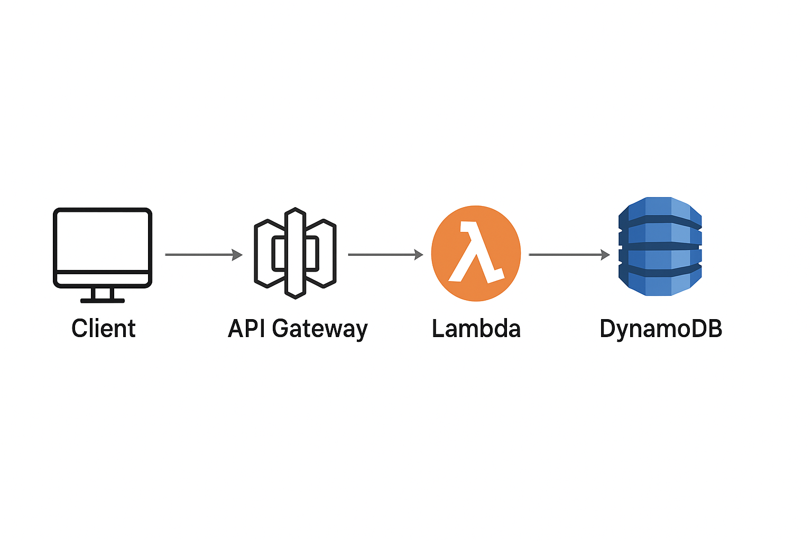

# 📂 Resume Management API (AWS Lambda + DynamoDB)

## 🚀 Overview
This project is a serverless API for managing resumes using **AWS Lambda, API Gateway, and DynamoDB**.  
It allows:
- Fetching a specific resume using `applicant_id`
- Retrieving all resumes when no `applicant_id` is provided

---

## 🏗️ Architecture


**Flow:**
1. Client sends GET request → API Gateway
2. API Gateway triggers Lambda
3. Lambda queries DynamoDB
4. Data returned as JSON response

---

## ⚙️ Tech Stack
- AWS Lambda (Serverless backend)
- API Gateway (REST API endpoint)
- DynamoDB (NoSQL database)
- IAM Roles (Secure permissions)
- CloudWatch (Monitoring & logs)

---

## 🖥️ Lambda Function
See full code in [`lambda_function.py`](lambda_function.py).

---

## 📊 Sample API Response
### ✅ Request:
GET https://<api-id>.execute-api.us-east-1.amazonaws.com/default/GetProcessedResumes?applicant_id=xyz123


### ✅ Response:
```json
{
  "ApplicantID": "xyz123",
  "Name": "John Doe",
  "Skills": ["Python", "AWS", "SQL"],
  "Experience": "3 years"
}

---

### 🛠️ Setup Instructions
1. Create a DynamoDB table **Resumes** with `ApplicantID` as the primary key.  
2. Deploy the `lambda_function.py` to **AWS Lambda**.  
3. Configure **API Gateway** to connect with Lambda.  
4. Assign **IAM role** with `dynamodb:GetItem` and `dynamodb:Scan` permissions.  
5. Test the API using query string:  ?applicant_id=xyz123


---

## 🚧 Challenges Faced
- **IAM Permission Errors** → Fixed with correct role policies.  
- **Decimal Serialization in DynamoDB** → Solved using a custom serializer.  
- **Debugging Integration** → Used **CloudWatch logs** for tracing issues.  

---

## 🔮 Future Enhancements
- Store actual resumes in **S3** and link via DynamoDB.  
- Add **authentication** with Amazon Cognito.  
- Build a **frontend UI** for recruiters.  

---